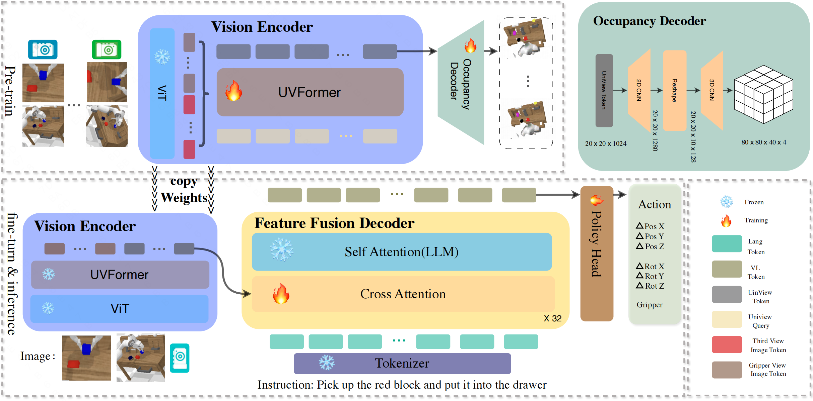
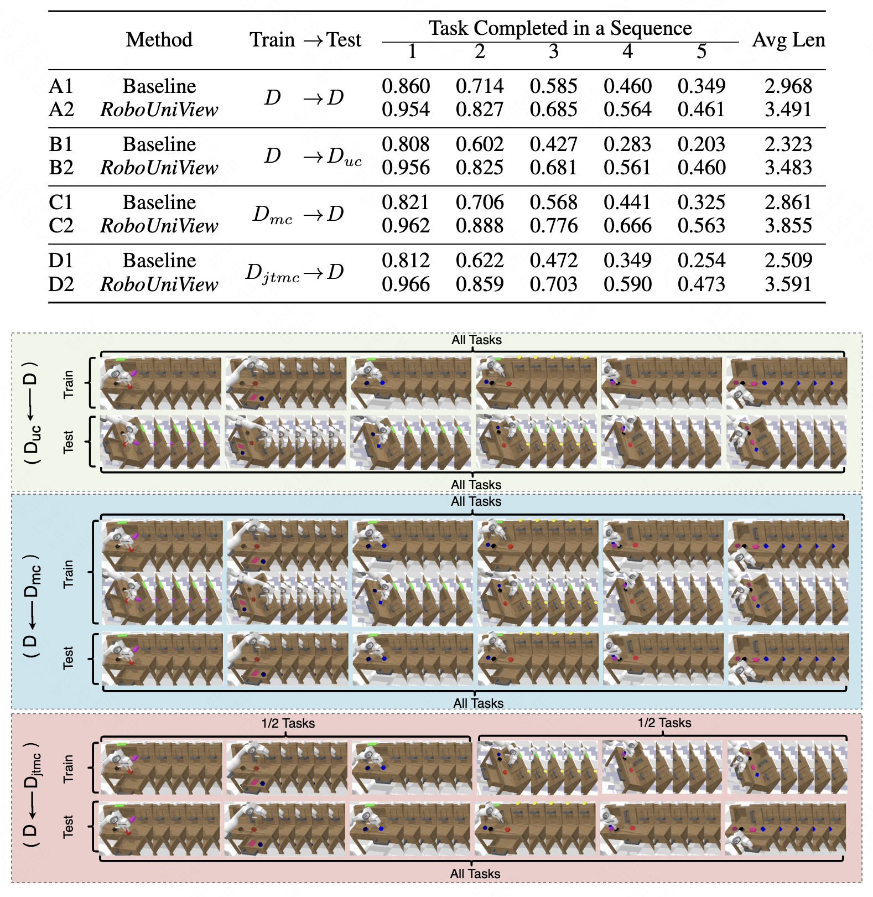

<!-- markdownlint-disable first-line-h1 -->
<!-- markdownlint-disable html -->


<h1 align="center">RoboUniView: Visual-Language Model with Unified View Representation for Robotic Manipulation</h1>





**RoboUniView**, an innovative approach that decouples visual feature extraction from action learning. We first learn a unified view representation from multi-perspective views by pre-training on readily accessible data, and then derive actions from this unified view representation to control robotic manipulation. This unified view representation more accurately mirrors the physical world and is not constrained by the robotic platform's camera parameters. Thanks to this methodology, we achieve state-of-the-art performance on the demanding CALVIN benchmark, enhancing the success rate in the D-D setting from 88.7% to 96.2%, and in the ABC-D setting from 82.4% to 94.2%. Moreover, our model exhibits outstanding adaptability and flexibility: it maintains high performance under unseen camera parameters, can utilize multiple datasets with varying camera parameters, and is capable of joint cross-task learning across datasets.
***
Project page:[https://liufanfanlff.github.io/RoboUniview.github.io/](https://liufanfanlff.github.io/RoboUniview.github.io/).

This is also the official code repo for the paper [RoboUniView: Visual-Language Model with Unified View Representation for Robotic Manipulaiton](https://arxiv.org/pdf/2406.18977).

If you have any questions about the paper and code, please contact us.

All our experiments are conducted on a 8 GPUS server with 8 Nvidia A100 GPUs (80G).


## Performance
We report results on the [CALVIN](https://github.com/mees/calvin) benchmark.
| Method                   | Training Data    | Test Split                 | 1          | 2          | 3          | 4          | 5          | Avg Len  |
|--------------------------|------------------|----------------------------|------------|------------|------------|------------|------------|--------- |
| MCIL                     | D                | D                          | 0.764      | 0.488      | 0.301      | 0.181      | 0.093      | 1.820    |
| GCBC                     | D                | D                          | 0.647      |0.284       | 0.122      | 0.049      | 0.013      | 1.110    | 
| LCD                      | D                | D                          | 0.887      |0.699       | 0.545      | 0.427      | 0.322      | 2.880    |
| SPIL                     | D                | D                          | 0.846      |0.651       | 0.508      | 0.380      | 0.286      | 2.640    |
| HULC                     | D                | D                          | 0.827      |0.649       |0.504       | 0.385      | 0.283      | 2.640    |
| RoboFlamingo             | D                | D                          | 0.860      | 0.714      | 0.585      | 0.460      | 0.349      | 2.968    |
| Ours                     | D                | D                          | **0.962**  | **0.888**  | **0.776**  | **0.666**  | **0.563**  | **3.855**|
| MCIL                     | ABC              | D                          | 0.304      |0.013       | 0.002      |0.000       |0.000       |0.400     |
| SPIL                     | ABC              | D                          | 0.742      |0.463       |0.276       |0.147       |0.080       |1.710     |
| HULC                     | ABC              | D                          | 0.481      |0.165       |0.057       |0.019       |0.011       |0.670     |
| RT-1                     | ABC              | D                          | 0.533      |0.222       |0.094       |0.038       |0.013       |0.900     |
| RoboFlamingo             | ABC              | D                          | 0.824      |0.619       |0.466       |0.331       |0.235       |2.470     |
| GR-1                     | ABC              | D                          | 0.854      |0.712       |0.596       |0.497       |0.401       |3.06      |
| 3D Diffuser Actor        | ABC              | D                          | 0.922      |0.787       |0.639       |0.512       |0.412       |3.270     |
| Ours                     | ABC              | D                          | **0.942**  | **0.842**  | **0.734**  | **0.622**  | **0.507**  | **3.647**|

## checkpoint
| Training Data    |  checkpoint         |
|------------------|---------------------|
| D                |[huggingface](https://huggingface.co/liufanfanlff/RoboUniView/tree/main/checkpoint_D_D)|

## generate_data:
The original CALVIN dataset does not include camera parameters; we collected images and camera parameters in a simulated environment based on the original data's state and saved them for training. The new camera setting data were generated in the same way.


For example, using CALVIN D_D:

1. Download the dataset and save it in the following format.

```
.../task_D_D
    - training
        - lang_annotations
            auto_lang_ann.npy
        *.npz
        *.npz
        ...
    - validation
        - lang_annotations
            auto_lang_ann.npy
        .hydra
            config.yaml
            hydra.yaml
            merged_config.yaml
            overrides.yaml
        *npz
        *npz
        ...
 ```   
2. Create new folders

```
mkdir  .../CALVIN/calvin_calib0/ 

mkdir  .../CALVIN/calvin_calib0/pjt 

mkdir  .../CALVIN/calvin_calib0/env_config 

mkdir  .../CALVIN/calvin_calib0/env_config/validation/ 

mkdir  .../CALVIN/calvin_calib0/training_npz_pcd_new

```
3. Clone the Calvin project in the .../CALVIN/calvin_calib0/pjt folder.
```
cd .../CALVIN/calvin_calib0/pjt
git clone https://github.com/mees/calvin.git 
```

4. Copy the .hydra folder from the dataset to .../CALVIN/calvin_calib0/env_config/validation/
``` cp -r .../task_D_D/validation/.hydra  .../CALVIN/calvin_calib0/env_config/validation/ ```

get：
```
.../CALVIN/calvin_calib0/
    - pjt
        - calvin
            - calvin_models
            - calvin_env
                - tacto_env
                ...
            ...
    - env_config
        - validation
            - .hydra
                config.yaml
                hydra.yaml
                merged_config.yaml
                overrides.yaml
    - training_npz_pcd_new

```
5. In robouniview/generate_data/generate_data.py, select the predefined three camera parameters at line 79, then run the script to generate data.
```
python3 robouniview/generate_data/generate_data.py 
```

## Training the model (using DDP):
Install MultiScaleDeformableAttention==1.0：
```
cd robouniview/models/transformers/ops/uvformer
sh make.sh
```
robouniview/models/transformers/ops/uvformer/make.sh
pretrain:
```
torchrun --nnodes=1 --nproc_per_node=8  robouniview/train/train.py \
    --config config/robouniview_pretrain.yaml
```

finetune:
```
torchrun --nnodes=1 --nproc_per_node=8  robouniview/train/train.py \
    --config config/robouniview_finetune.yaml
```


## Evaluating the model on the CALVIN benchmark
```
python eval_ckpts.py
```

## Train on a multi camera setting dataset：
```
torchrun --nnodes=1 --nproc_per_node=8  robouniview/train/train.py \
    --config config/robouniview_finetune_multi_camera_setting.yaml
```


## Acknowledgment

#### CALVIN
Original:  [https://github.com/mees/calvin](https://github.com/mees/calvin)
License: [MIT](https://github.com/mees/calvin/blob/main/LICENSE)

#### OpenAI CLIP
Original: [https://github.com/openai/CLIP](https://github.com/openai/CLIP)
License: [MIT](https://github.com/openai/CLIP/blob/main/LICENSE)

#### OpenFlamingo
Original: [https://github.com/mlfoundations/open_flamingo](https://github.com/mlfoundations/open_flamingo)
License: [MIT](https://github.com/mlfoundations/open_flamingo/blob/main/LICENSE)

#### RoboFlamingo
Original: [https://github.com/RoboFlamingo/RoboFlamingo](https://github.com/RoboFlamingo/RoboFlamingo)
License: [MIT](https://github.com/RoboFlamingo/RoboFlamingo/blob/main/LICENSE)

## Cite our work:
```
@article{li2024RoboUniView
  title     = {RoboUniView: Visual-Language Model with Unified View Representation for Robotic Manipulaiton},
  author    = {Liu, Fanfan and Yan, Feng and Zheng, Liming and Huang, Yiyang and Feng, Chengjian and Ma, Lin},
  journal={arXiv preprint 2406.18977},
  year={2024}
}
```
